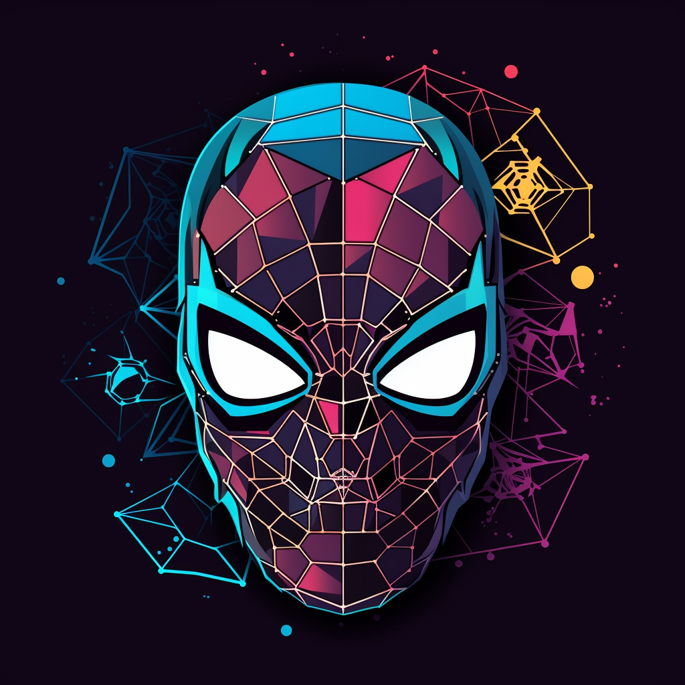
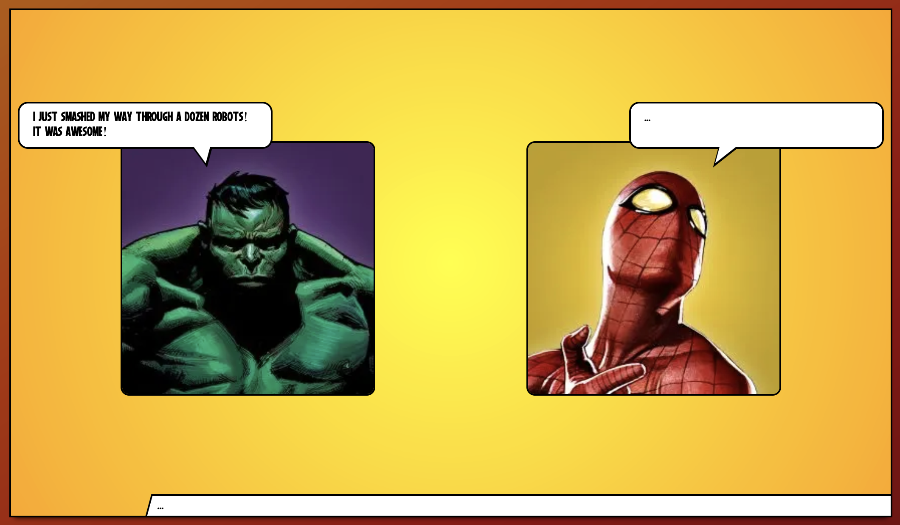

  <div align="center">
  <a href="https://github.com/clementlebas/light-image-gallery">
    
  </a>

  <h2 align="center">marvel-comics-ai</h3>

  <a href="https://github.com/clementlebas/light-image-gallery/issues">Report Bug</a>
  <br />
  <br />
</div>


  
  <p align="left" id="about-the-project">
    This Next application is a small project to make interaction between two super heroes in a Marvel comics board look. 
    <br />
    It use OpenAI and Marvel API.
    <br />
    <br /> 
  </p>



## Getting Started

This is a [Next.js](https://nextjs.org/) project (Typescript, ReactJS, NextUI, Eslint, Prettier, Jest)

First, run the development server:

```bash
npm install
npm run dev
```

Open [http://localhost:3000](http://localhost:3000) with your browser to see the result.

Don't forget to create a .env with your Marvel API key and OpenAI API key.

## Deploy on Vercel

The easiest way to deploy your Next.js app is to use the [Vercel Platform](https://vercel.com/new?utm_medium=default-template&filter=next.js&utm_source=create-next-app&utm_campaign=create-next-app-readme) from the creators of Next.js.

Check out our [Next.js deployment documentation](https://nextjs.org/docs/deployment) for more details.
